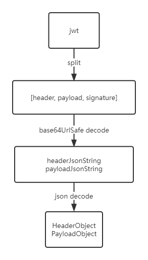

# 三方库设计说明

## 1 需求场景分析

    一个基于RFC 7519 的 JSON Web Token 和 JSON Web Signature的仓颉库。

## 2 三方库对外提供的特性

    （1）支持构建jwt
    （2）支持解析jwt
    （3）支持校验jwt
        HMAC 算法签名及验证
        ECDSA 算法签名及验证
        RSA 算法签名及验证
        Payload 内容进行业务校验

## 3 License分析

    MIT License

    |  Permissions   | Limitations  |
    |  ----  | ----  |
    | Commercial use |  |
    | Modification  |   |
    | Distribution  |   |
    | Private use   |   |

## 4 依赖分析 
    依赖
    cangjie库：cryptocj

## 5 特性设计文档

### 5.1 JWT生成/解析/校验
#### 5.1.1 特性介绍
    外部操作的入口， jwt生成/解析/校验
#### 5.1.2 实现方案
##### JWT入口

    JWT.create() -> Builder                  // 构造jwt, 创建Builder
    JWT.decode(jwt) -> DecodedJWT            // 解析jwt, 传入jwt, 创建解析对象DecodedJWT
    JWT.require(Algorithm) -> Verification   // 校验jwt, 传入算法, 创建校验对象Verification
##### Builder
    Builder.withHeader(Map<key, value>) -> Builder   // 设置header
    Builder.withClaim(key, value) -> Builder         // 设置payload
    Builder.with... -> Builder                       // 设置标准字段的值
    Builder.sign(Algorithm) -> String                // 传入算法, 执行签名, 构造jwt
        JWTCreator.sign() -> String
            base64Encode(headerJson) -> headerB64       // base64 encode
            base64Encode(payloadJson) -> payloadB64     // base64 encode

            Algorithm.sign("headerB64.payloadB64") -> signatureBytes    // sign
            base64Encode(signatureBytes) -> signature                   // base64 encode

            headerB64.payloadB64.signature -> jwt   // jwt create
##### DecodedJWT

    DecodedJWT.init(jwt) -> DecodedJWT   // 调用jwt编解码模块, 解析jwt
##### Verification
    Verification.init(Algorithm) -> Verification         // 设置算法
    Verification.withClaim(key, value) -> Verification   // 添加claim检验规则
    Verification.build() -> JWTVerifier                  // build JWTVerifier
    JWTVerifier.verify(jwt) -> DecodedJWT                // 校验, 返回jwt解析结果

### 5.2 jwt编解码
#### 5.2.1 特性介绍
    对jwt中的header/payload进行base64/json编解码
#### 5.2.2 实现方案
##### encode
    JWTCreator.init(Algorithm, headerClaims, payloadClaims) -> JWTCreator
        HeaderSerializer.serialize(headerClaims) -> headerJson      // json encode
        PayloadSerializer.serialize(payloadClaims) -> payloadJson   // json encode
##### decode
    JWTDecoder.init(jwt) -> JWTDecoder
        split(jwt) -> [headerString, payloadString, signature]  // split

        base64Decode(headerString) -> headerJson    // base64 decode
        base64Decode(payloadString) -> payloadJson  // base64 decode

        JWTParser.parseHeader(headerJson) -> Header                     // json decode
            HeaderDeserializer.doDeserialize(headerJson) -> Header      // json decode
        JWTParser.parsePayload(payloadJson) -> Payload                  // json decode
            PayloadDeserializer.doDeserialize(payloadJson) -> Payload   // json decode

### 5.3 加密算法 
#### 5.3.1 特性介绍
    使用HMAC/RSA/ECDSA加密算法和SHA256/SHA384/SHA512摘要算法
#### 5.3.2 实现方案
    使用cryptocj提供的签名验签api
    Algorithm.hmac256() -> HMACAlgorithm    // 传入密钥信息, 创建算法对象
    Algorithm.hmac384() -> HMACAlgorithm    // 传入密钥信息, 创建算法对象
    Algorithm.hmac512() -> HMACAlgorithm    // 传入密钥信息, 创建算法对象
    Algorithm.rsa256() -> RSAAlgorithm      // 传入密钥信息, 创建算法对象
    Algorithm.rsa384() -> RSAAlgorithm      // 传入密钥信息, 创建算法对象
    Algorithm.rsa512() -> RSAAlgorithm      // 传入密钥信息, 创建算法对象
    Algorithm.ecdsa256() -> ECDSAAlgorithm  // 传入密钥信息, 创建算法对象
    Algorithm.ecdsa384() -> ECDSAAlgorithm  // 传入密钥信息, 创建算法对象
    Algorithm.ecdsa512() -> ECDSAAlgorithm  // 传入密钥信息, 创建算法对象
    Algorithm.none() -> NoneAlgorithm       // none
    Algorithm.sign() -> signature           // 签名
    Algorithm.verify() -> Unit              // 验签
